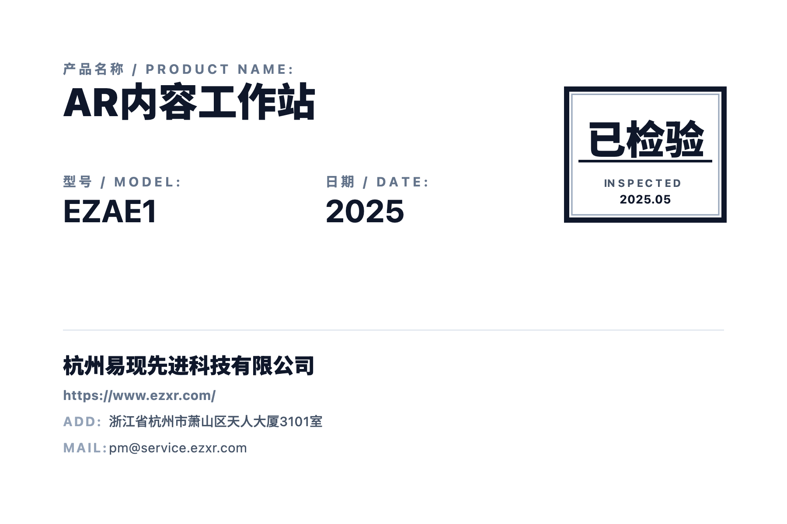

# LabelGen Pro

一个专业级的标签生成器，支持高质量的产品标签创建、预览和导出。


## 📸 效果示例

<div align="center">
  
  <p><em>LabelGen Pro 生成的专业产品标签示例</em></p>
</div>

## ✨ 功能特性

### 🏷️ 标签编辑
- **产品信息管理**：产品名称、型号、生产年份
- **质量控制**：QC 状态、QC 日期记录
- **公司信息**：公司名称、网站、地址、邮箱
- **实时预览**：所见即所得的标签预览

### 📤 高质量导出
- **PNG 图片导出**：基于 Canvas 的高 DPI 导出 (3倍分辨率)
- **PDF 文档导出**：支持 PDF 格式的标签文档
- **打印功能**：浏览器原生打印支持
- **完美一致性**：预览效果与导出结果 100% 一致

### 🎨 设计特色
- **工业风格设计**：专业的质检标签外观
- **多语言支持**：中英文双语标签内容
- **高质量字体**：使用 Noto Sans SC 和 Roboto Mono
- **精确布局**：像素级精确的标签布局控制

## 🚀 快速开始

### 环境要求
- Node.js 18+
- npm 或 yarn

### 安装依赖
```bash
npm install
```

### 开发模式
```bash
npm run dev
```

应用将在 http://localhost:3000 启动

### 构建生产版本
```bash
npm run build
```

### 预览构建版本
```bash
npm run preview
```

## 📖 使用指南

### 1. 填写标签信息
在左侧编辑面板中填写以下信息：

#### 产品详情
- **Product Name (产品名称)**：产品的中英文名称
- **Model (产品型号)**：产品型号编码
- **Production Year**：生产年份

#### 质量控制
- **QC Status (质检状态)**：如"合格"、"PASS"等
- **QC Date**：质检日期

#### 公司信息
- **Company Name**：公司全称
- **Website URL**：公司网站地址
- **Full Address**：公司详细地址
- **Email Address**：联系邮箱

### 2. 实时预览
右侧区域会实时显示标签的预览效果，包括：
- 专业的质检标记样式
- 清晰的信息分层
- 准确的字体大小和间距

### 3. 导出标签
点击顶部工具栏的导出按钮：
- **📷 Image**：导出 PNG 格式图片
- **📄 PDF**：导出 PDF 文档
- **🖨️ Print**：直接打印标签

## 🏗️ 技术架构

### 核心技术栈
- **前端框架**：React 19.2.1 + TypeScript
- **构建工具**：Vite 6.2.0
- **样式方案**：Tailwind CSS
- **图标库**：Lucide React
- **字体支持**：Google Fonts (Noto Sans SC, Roboto Mono)

### 导出技术
- **Canvas API**：自定义 Canvas 导出器，确保完美渲染
- **高 DPI 支持**：3倍分辨率输出，确保打印质量
- **字体渲染**：精确的字体控制和字母间距模拟
- **HTML2Canvas**：备用渲染方案

### 项目结构
```
labelgen-pro/
├── components/
│   ├── LabelEditor.tsx      # 标签编辑组件
│   ├── LabelPreview.tsx     # 标签预览组件
│   ├── QRCode.tsx          # 二维码组件
│   └── Barcode.tsx         # 条形码组件
├── utils/
│   └── canvasExport.ts     # Canvas 导出器
├── types.ts               # TypeScript 类型定义
├── App.tsx               # 主应用组件
└── index.html            # 应用入口
```

## 📋 标签规格

### 标签尺寸
- **标准尺寸**：600px × 400px
- **打印尺寸**：约 4×6 英寸
- **分辨率**：1800×1200px (3倍 DPI)

### 字体规范
- **产品名称**：Noto Sans SC, 30px, font-black
- **产品型号/日期**：Roboto Mono, 24px, font-bold
- **标签文字**：Noto Sans SC, 10px, font-bold
- **公司信息**：Noto Sans SC, 16px, font-black

### 颜色方案
- **主文字**：slate-900 (#0f172a)
- **标签文字**：slate-500 (#64748b)
- **辅助文字**：slate-600 (#475569)
- **地址标签**：slate-400 (#94a3b8)

## 🎯 使用场景

### 制造业标签
- 产品质量控制标签
- 生产信息标签
- 合格证标签

### 物流标签
- 仓储管理标签
- 运输标签
- 库存标签

### 其他应用
- 设备铭牌
- 保修标签
- 资产管理标签

## 🔧 自定义配置

### 修改标签尺寸
在 `utils/canvasExport.ts` 中修改默认尺寸：
```typescript
const exporter = new CanvasExporter({
  width: 600,  // 标签宽度 (px)
  height: 400, // 标签高度 (px)
  padding: 48, // 内边距 (px)
  // ...其他选项
});
```

### 修改字体和样式
在 `utils/canvasExport.ts` 中自定义字体：
```typescript
// 修改产品名称字体
this.ctx.font = '900 30px "Your Custom Font", sans-serif';

// 修改颜色
this.ctx.fillStyle = '#your-custom-color';
```

## 🤝 贡献指南

### 开发流程
1. Fork 项目
2. 创建功能分支：`git checkout -b feature/amazing-feature`
3. 提交更改：`git commit -m 'Add amazing feature'`
4. 推送分支：`git push origin feature/amazing-feature`
5. 提交 Pull Request

### 代码规范
- 使用 TypeScript 进行类型检查
- 遵循 React Hooks 最佳实践
- 使用 ESLint 进行代码检查
- 组件使用 PascalCase 命名
- 文件名使用 camelCase 命名

## 📝 更新日志

### v1.0.0 (2025-12)
- ✨ 初始版本发布
- 🏷️ 完整的标签编辑功能
- 📤 高质量图片和 PDF 导出
- 🎨 专业的工业风格设计

## 📄 许可证

本项目采用 MIT 许可证 - 查看 [LICENSE](LICENSE) 文件了解详情

## 🙏 致谢

- [React](https://reactjs.org/) - UI 框架
- [Vite](https://vitejs.dev/) - 构建工具
- [Tailwind CSS](https://tailwindcss.com/) - CSS 框架
- [Lucide](https://lucide.dev/) - 图标库
- [Google Fonts](https://fonts.google.com/) - 字体资源

---

<div align="center">
  <p>🏷️ LabelGen Pro - 专业标签生成器</p>
  <p>❤️ 用心打造每一个标签</p>
</div>
